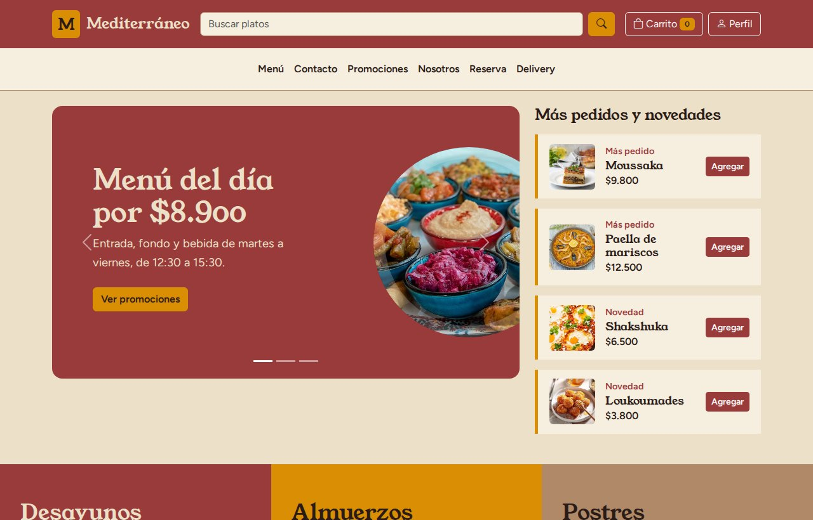
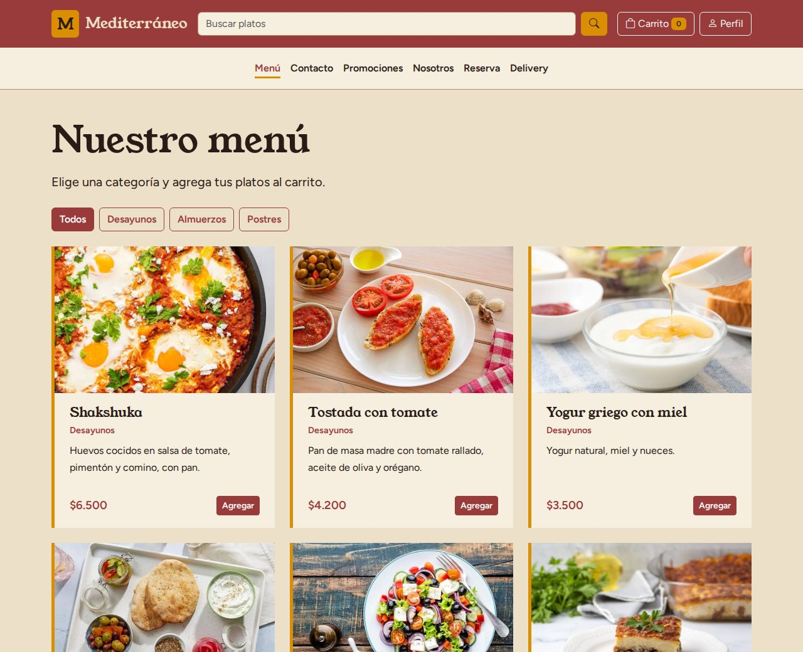
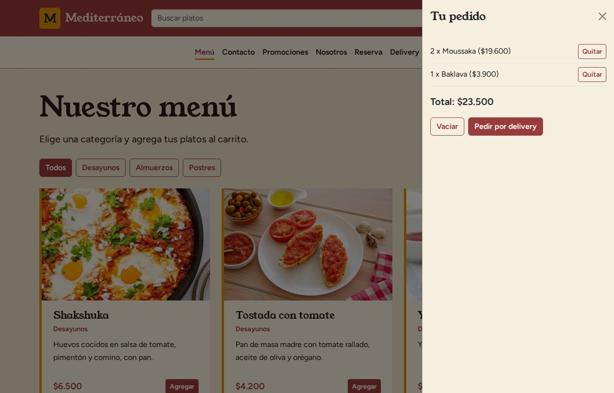
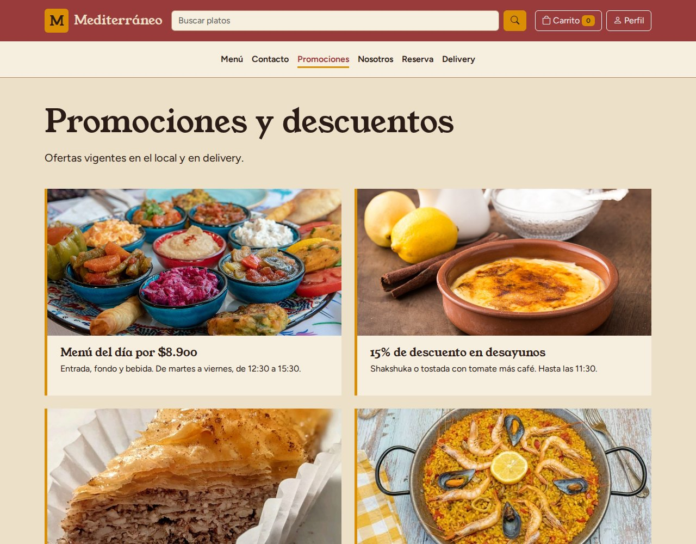

# Mediterráneo

Sitio web de **Mediterráneo**, un restaurante de cocina mediterránea (Grecia, Italia, España y Líbano). Incluye carta con fotos, carrito de pedidos, promociones, reservas, contacto y una página de delivery.

Es un proyecto **100 % front-end**: HTML, CSS y JavaScript, sin build ni dependencias que instalar.



## Contenido

- [Qué incluye](#qué-incluye)
- [Tecnologías](#tecnologías)
- [Cómo ejecutarlo](#cómo-ejecutarlo)
- [Publicarlo con GitHub Pages](#publicarlo-con-github-pages)
- [Estructura del proyecto](#estructura-del-proyecto)
- [Cómo funciona](#cómo-funciona)
- [Cómo modificarlo](#cómo-modificarlo)
- [Accesibilidad](#accesibilidad)
- [Limitaciones](#limitaciones)
- [Autores](#autores)
- [Imágenes y licencia](#imágenes-y-licencia)

## Qué incluye

| Página | Archivo | Qué hace |
|---|---|---|
| Inicio | `index.html` | Carrusel de promociones, "Más pedidos y novedades" y accesos a Desayunos, Almuerzos y Postres. |
| Menú | `menu.html` | 13 platos con foto, filtro por categoría y búsqueda. Cada plato se agrega al carrito. |
| Promociones | `promociones.html` | Menú del día, 15 % en desayunos, postres 2x1 y delivery gratis sobre $20.000. |
| Reserva | `reserva.html` | Formulario para grupos de 2 a 12 personas (no permite fechas pasadas). |
| Contacto | `contacto.html` | Formulario de contacto y datos del local. |
| Delivery | `delivery.html` | Cómo pedir y datos del reparto. |
| Nosotros | `nosotros.html` | Quiénes somos, misión, visión y equipo. |

Además, todas las páginas comparten:

- **Carrito** en un panel lateral (offcanvas), con contador en el encabezado, total y botones para quitar platos o vaciarlo. Se conserva al recargar la página.
- **Buscador** en el encabezado que lleva al menú con los resultados.
- **Acceso de usuario** simulado en un modal: guarda el nombre y lo muestra en el botón "Perfil".
- Diseño **responsive** (móvil, tablet y escritorio).

### Capturas

| Menú | Carrito |
|---|---|
|  |  |



## Tecnologías

- **HTML5** y **CSS3** (variables CSS para la paleta de colores).
- **JavaScript** vanilla, sin frameworks.
- [**Bootstrap 5.3.8**](https://getbootstrap.com/) para la grilla y los componentes (carrusel, offcanvas, modal).
- [**Bootstrap Icons 1.11.3**](https://icons.getbootstrap.com/).
- [**Google Fonts**](https://fonts.google.com/): *Figtree* (texto) y *Young Serif* (títulos).

Bootstrap, los íconos y las fuentes se cargan desde CDN, así que **necesitas conexión a internet** para verlo con todos sus estilos.

## Cómo ejecutarlo

No hay nada que instalar ni compilar.

**1. Descarga el proyecto**

```bash
git clone https://github.com/<tu-usuario>/<tu-repositorio>.git
cd <tu-repositorio>
```

O descarga el ZIP desde el botón verde **Code → Download ZIP** y descomprímelo.

**2. Ábrelo en el navegador**

La forma más simple es hacer doble clic en `index.html`.

**3. (Recomendado) Sírvelo con un servidor local**

El doble clic funciona, pero un servidor local se parece más a cómo se verá el sitio ya publicado. Con Python (que ya viene en la mayoría de los computadores):

```bash
python3 -m http.server 8000
```

y abre <http://localhost:8000>. Si usas Visual Studio Code, también sirve la extensión **Live Server** (clic derecho sobre `index.html` → *Open with Live Server*).

## Publicarlo con GitHub Pages

Como es un sitio estático, puedes dejarlo online gratis:

1. Sube el proyecto a un repositorio de GitHub, con `index.html` en la raíz.
2. Ve a **Settings → Pages**.
3. En **Build and deployment**, elige **Deploy from a branch**, selecciona la rama `main` y la carpeta `/ (root)`, y guarda.
4. Espera un par de minutos. El sitio quedará en `https://<tu-usuario>.github.io/<tu-repositorio>/`.

## Estructura del proyecto

```
.
├── index.html              # Inicio
├── menu.html               # Carta con filtros y búsqueda
├── promociones.html
├── reserva.html
├── contacto.html
├── delivery.html
├── nosotros.html
├── css/
│   └── estilo.css          # Paleta, tipografías y estilos propios
├── js/
│   ├── comun.js            # Buscador y acceso de usuario (todas las páginas)
│   ├── carrito.js          # Carrito de compras (todas las páginas)
│   ├── inicio.js           # Carrusel de promociones
│   ├── menu.js             # Lista de platos, filtros y búsqueda
│   ├── reserva.js          # Formulario de reserva
│   └── contacto.js         # Formulario de contacto
├── imagenes/               # Fotos de los platos y de las promociones
└── docs/capturas/          # Capturas usadas en este README
```

## Cómo funciona

Cada página HTML carga primero `comun.js` y `carrito.js`, y después el script propio de esa página.

### Carrito (`js/carrito.js`)

- Guarda el pedido en `localStorage` bajo la clave `carrito`, como una lista de objetos `{ nombre, precio, cantidad }`.
- `agregarAlCarrito(nombre, precio)` suma una unidad si el plato ya existe; `quitarDelCarrito(nombre)` lo elimina.
- `mostrarCarrito()` vuelve a dibujar la lista, el total y el contador cada vez que cambia el pedido.
- Los precios se formatean con `toLocaleString("es-CL")`, por ejemplo `$12.500`.

### Menú (`js/menu.js`)

- Todos los platos están en el arreglo `platos`, con nombre, categoría, descripción, precio e imagen.
- Las tarjetas se generan con JavaScript a partir de ese arreglo.
- Filtra por categoría (**Todos**, **Desayunos**, **Almuerzos**, **Postres**) y por texto, que se busca en el nombre y la descripción.
- Lee la URL, así que se pueden enlazar vistas concretas:

  | URL | Resultado |
  |---|---|
  | `menu.html?categoria=Postres` | Solo los postres. |
  | `menu.html?buscar=miel` | Platos que mencionan "miel". |
  | `menu.html?categoria=Almuerzos&buscar=pita` | Combinación de ambos. |

### Comunes (`js/comun.js`)

- Rellena el buscador con el término de la URL (`?buscar=`).
- El modal "Iniciar sesión" toma la parte del correo antes de la `@`, la guarda en `localStorage` (clave `usuario`) y la muestra en el botón "Perfil".

### Inicio (`js/inicio.js`)

Activa el carrusel de promociones. Si el sistema del usuario tiene activada la opción de **reducir movimiento** (`prefers-reduced-motion`), el carrusel no avanza solo.

### Formularios (`js/reserva.js` y `js/contacto.js`)

- Validan con los atributos HTML (`required`, `type="email"`) y muestran un mensaje de confirmación en la misma página.
- La fecha mínima de la reserva es el día de hoy.

## Cómo modificarlo

### Agregar o cambiar un plato

1. Guarda la foto en `imagenes/`. Lo ideal es formato **3:2**, de unos 800 px de ancho y en JPG, con un nombre en minúsculas y con guiones (`tabbouleh.jpg`).
2. Agrega un objeto al arreglo `platos` de `js/menu.js`:

   ```js
   { nombre: "Tabbouleh", categoria: "Almuerzos", descripcion: "Perejil, tomate, trigo burgol y limón.", precio: 5500, imagen: "tabbouleh.jpg" }
   ```

   La categoría debe ser una de: `Desayunos`, `Almuerzos` o `Postres`.

### Cambiar los colores

La paleta está al inicio de `css/estilo.css`:

```css
:root {
    --rojo: #9A3B3B;
    --rojo-oscuro: #7F2F2F;
    --mostaza: #D98E04;
    --capuccino: #B08968;
    --crema: #EDE0C8;
    --crema-clara: #F6EEDF;
    --cafe: #2B1B17;
}
```

### Cambiar las fotos de las promociones

- **Carrusel del inicio:** cada slide usa un círculo con una clase (`circulo-menu-dia`, `circulo-desayunos`, `circulo-postres`) cuya imagen se define en `css/estilo.css`.
- **Página de promociones:** cada tarjeta tiene su `` en `promociones.html`.

### Cambiar horarios, teléfono y dirección

Estos datos están escritos directamente en el HTML, en el pie de página de cada archivo y en `contacto.html`, `reserva.html` y `delivery.html`. Si los cambias, hazlo en todos los archivos.

## Accesibilidad

- Idioma de la página declarado (`lang="es"`).
- Textos alternativos en las fotos de los platos y de las promociones.
- Los botones que solo tienen ícono o dicen "Agregar" tienen `aria-label` descriptivo (por ejemplo, *Agregar Moussaka al carrito*).
- Indicador de foco visible al navegar con teclado.
- El contador del carrito usa `aria-live` y los mensajes de los formularios usan `role="status"`.
- Respeta `prefers-reduced-motion` en el carrusel.

## Limitaciones

Es un proyecto de front-end, así que:

- **No hay servidor ni base de datos.** Los formularios de reserva y contacto solo muestran un mensaje de confirmación; no envían nada.
- **El inicio de sesión es simulado.** No valida ni guarda contraseñas.
- **El carrito no procesa pagos.** El pedido se confirma por teléfono o WhatsApp, como se indica en la página de Delivery.
- Los datos (carrito y nombre de usuario) viven en el `localStorage` de cada navegador.
- Sin internet no cargan Bootstrap, los íconos ni las fuentes.

## Autores

Sitio desarrollado por:

- Maximiliano Urizar
- Fabian Monardez

## Imágenes y licencia

Las fotografías de la carpeta `imagenes/` son material de terceros y **no fueron tomadas por los autores**; pertenecen a sus respectivos dueños. Antes de reutilizar este proyecto con fines comerciales, verifica los derechos de cada imagen o reemplázalas por fotos propias.

Este repositorio todavía no define una licencia para el código. Si quieres que otras personas puedan reutilizarlo, agrega un archivo `LICENSE` (por ejemplo, [MIT](https://choosealicense.com/licenses/mit/)).
